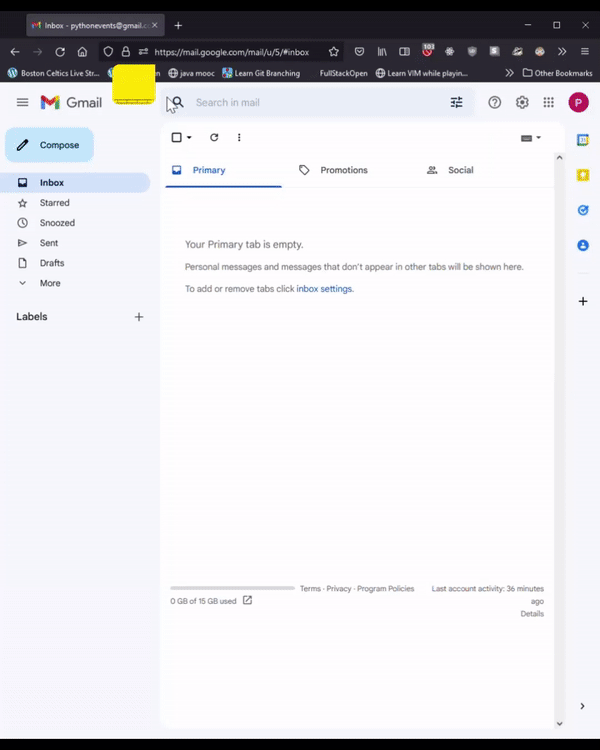

## PythonEvents

This is a submission for the OSU Hackathon Fall 2022. 

## Table of contents

- [Python Events](#python-events)
  - [Table of contents](#table-of-contents)
  - [Overview](#overview)
    - [Screenshots](#screenshots)
    
  - [Built with](#built-with)
  - [Lessons Learned](#lessons-learned)
  - [Continued development](#continued-development)
  - [Usefull resources](#usefull-resources)
   
 - [Authors](#authors)

## Overview
Oregon State University(OSU) Hackathon club put togeather "Beaver Hacks Fall 2022." The event was set up to help students learn new skills, build cool stuff, and compete for prizes. Our team concisted of two new students to the OSU Computer Science post bacc program and competed in the new student catagory. The prompt of the Hackathon was "Life Hacks" and the goal was to build a program that fits this prompt in three days. 

## The Challenge
Based on the prompt our team wanted to pursue a project geared towards automating "Night Life". Accordingly, we came up with Python Events as a way to find out about what concerts were happening on a daily basis. Once called, the Python Events script makes a request to the SeatGeek API, formats the concert data to HTML and then sends a nicely formatted email to our inboxes.

## Screenshots

## Built With
- requests library to access the seatgeek api
- smtplib library to send emails using the smtp protacol 
- os and dotenv librarys to store api credentials in an .env file
- datetime and time librarys
- jinja2 

## Lessons Learned
- How to make simple API requests
- Sending email from a python program 
- Basic HTML formatting
- Using Git and Github in a team enviornment

## Continued development

In the future we would like to return and implement the following
- Using Time benchmarks to indicate script speed following program edits
- CSS styling
- API requests for other event types like comedy, sports, etc.
- Deployment to PythonAnywhere & automating script call once API url has been whitelisted.
- Web application for signing up for an email based on user's event preferences.
  Python script will make a request to user address & preferences endpoint and send emails.

## Usefull resources
- [Managing PyCharm projects under Version Control Systems](https://intellij-support.jetbrains.com/hc/en-us/articles/206544839)
- [Forking vs Branching](https://stackoverflow.com/questions/3611256/forking-vs-branching-in-github)
- [Environment Variables in Python](https://developer.vonage.com/blog/21/10/01/python-environment-variables-a-primer)
- [Building dynamic HTML content](https://stackoverflow.com/questions/30180406/building-dynamic-html-email-content-with-python)
- [Converting date-time strings](https://stackabuse.com/converting-strings-to-datetime-in-python/)
- [Sending smtplib email - pt.1 ](https://pythonassets.com/posts/send-html-email-with-attachments-via-smtp/)
- [Sending smtplib email - pt.2 ](https://coderzcolumn.com/tutorials/python/smtplib-simple-guide-to-sending-mails-using-python)
- [Documentation on Python Email class](https://docs.python.org/3/library/email.html#module-email)
- [Python Anywhere](https://stackoverflow.com/questions/71138889/max-retries-exceeded-caused-by-proxyerrorcannot-connect-to-proxy-oserror)

## Authors
- GitHub - [@Gomurmamma](https://github.com/Gomurmamma)
- GitHub - [@merritcl](https://github.com/merritcl)
